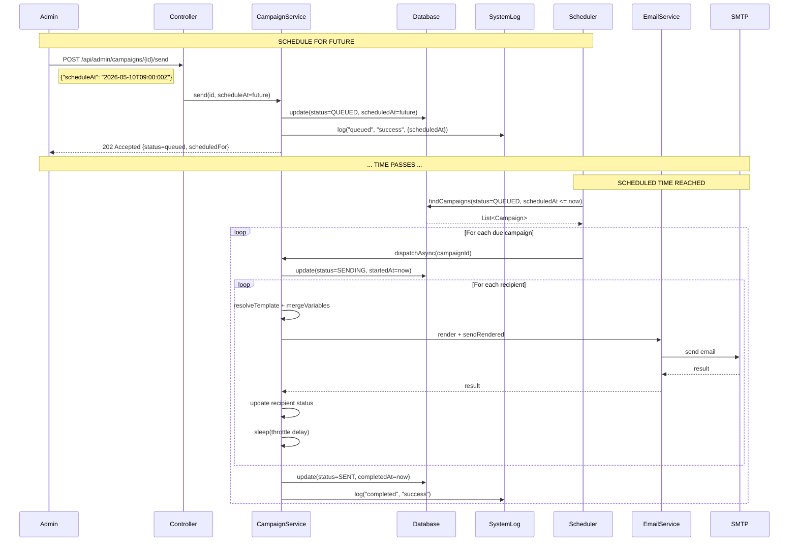
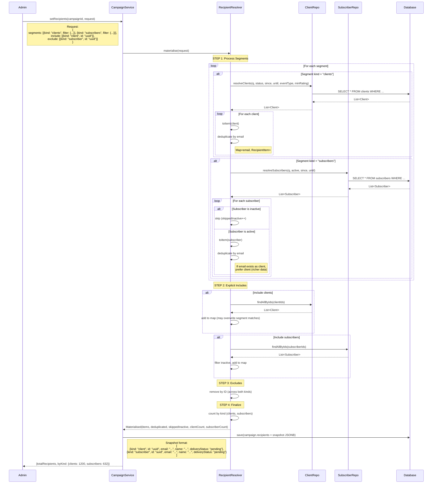
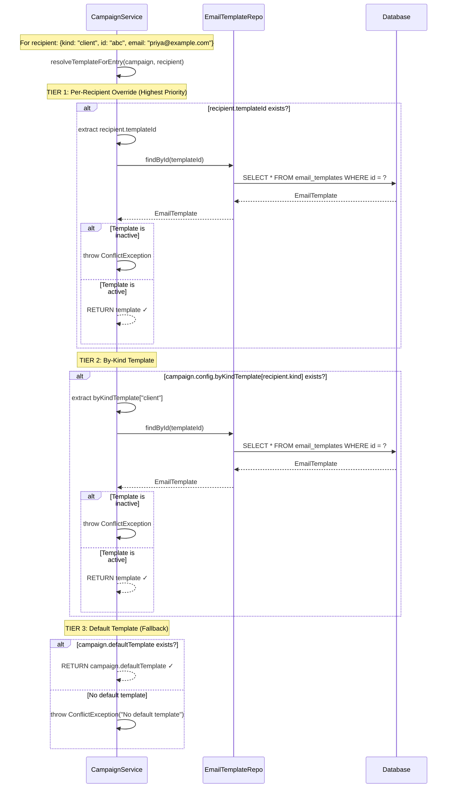
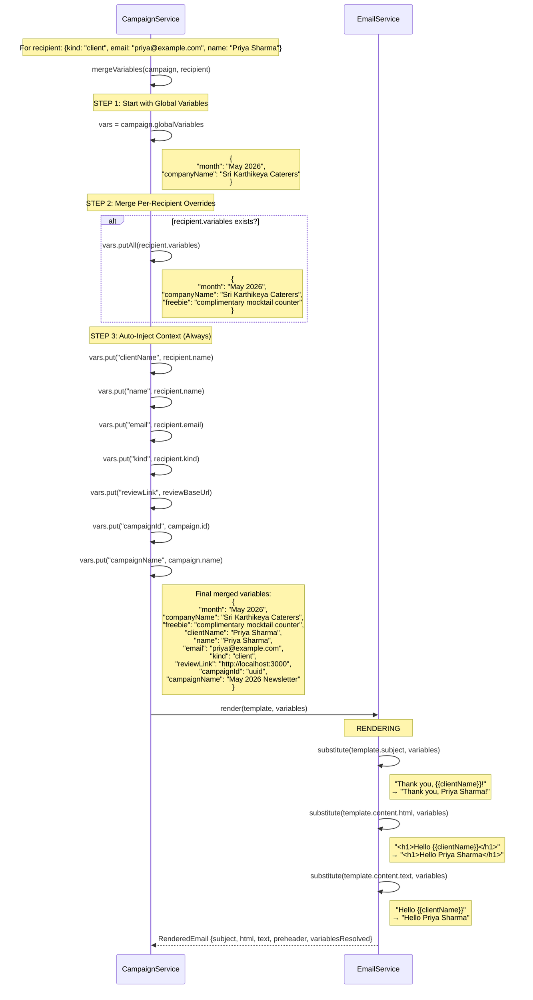
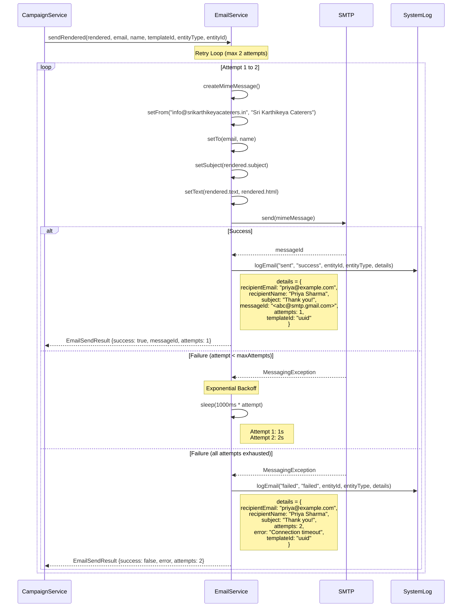
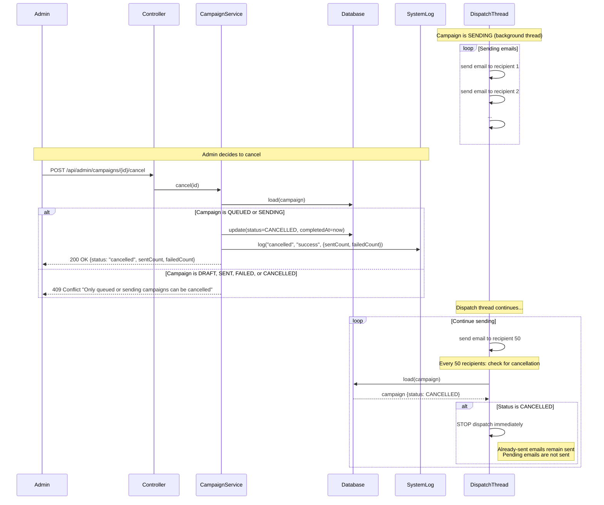
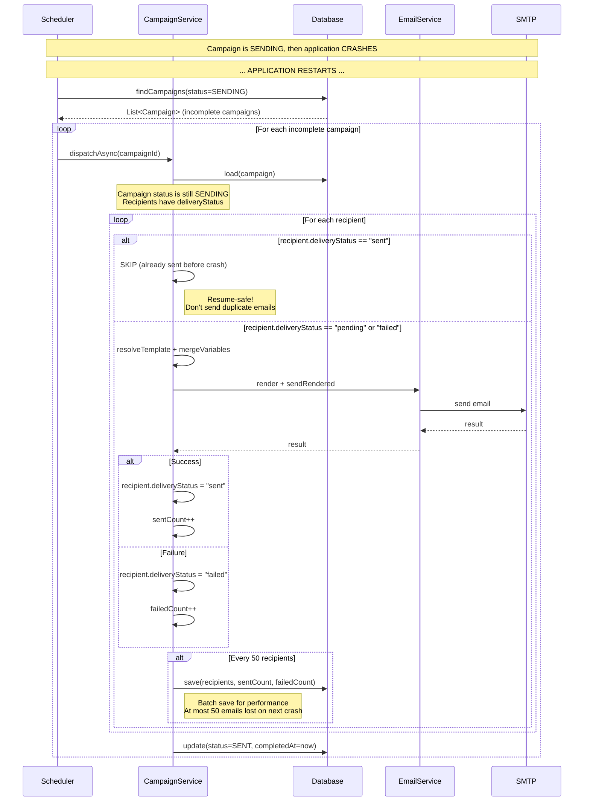

# Email Sending & Scheduling - Sequence Diagrams

## 1. Complete Campaign Flow (Immediate Send)

```mermaid
sequenceDiagram
    participant Admin
    participant Controller
    participant CampaignService
    participant RecipientResolver
    participant ClientRepo
    participant SubscriberRepo
    participant EmailService
    participant SMTP
    participant SystemLog
    participant Database

    Note over Admin,Database: PHASE 1: CREATE CAMPAIGN
    Admin->>Controller: POST /api/admin/campaigns
    Controller->>CampaignService: create(request)
    CampaignService->>Database: save(campaign, status=DRAFT)
    CampaignService->>SystemLog: log("created", "success")
    CampaignService-->>Admin: 201 Created {campaignId}

    Note over Admin,Database: PHASE 2: ADD RECIPIENTS
    Admin->>Controller: POST /api/admin/campaigns/{id}/recipients
    Controller->>CampaignService: setRecipients(id, request)
    CampaignService->>RecipientResolver: materialise(segments, include, exclude)
    
    alt Segment: Clients
        RecipientResolver->>ClientRepo: resolveClients(filters)
        ClientRepo-->>RecipientResolver: List<Client>
    end
    
    alt Segment: Subscribers
        RecipientResolver->>SubscriberRepo: resolveSubscribers(filters)
        SubscriberRepo-->>RecipientResolver: List<Subscriber>
    end
    
    RecipientResolver->>RecipientResolver: deduplicate by email
    RecipientResolver->>RecipientResolver: filter inactive subscribers
    RecipientResolver-->>CampaignService: Materialised(items, stats)
    
    CampaignService->>Database: save(campaign.recipients = snapshot)
    CampaignService->>SystemLog: log("recipients_set", "success")
    CampaignService-->>Admin: 200 OK {totalRecipients, byKind}

    Note over Admin,Database: PHASE 3: ASSIGN TEMPLATES
    Admin->>Controller: PUT /api/admin/campaigns/{id}/templates
    Controller->>CampaignService: assignTemplates(id, request)
    CampaignService->>Database: update(defaultTemplate, byKindTemplate, perRecipient)
    CampaignService->>SystemLog: log("templates_assigned", "success")
    CampaignService-->>Admin: 200 OK {templatesValidated}

    Note over Admin,Database: PHASE 4: PREVIEW (Optional)
    Admin->>Controller: POST /api/admin/campaigns/{id}/preview
    Controller->>CampaignService: preview(id, sample=3)
    loop For each sample recipient
        CampaignService->>CampaignService: resolveTemplate(3-tier)
        CampaignService->>CampaignService: mergeVariables(global+recipient)
        CampaignService->>EmailService: render(template, variables)
        EmailService->>EmailService: substitute {{variables}}
        EmailService-->>CampaignService: RenderedEmail(html, text, subject)
    end
    CampaignService-->>Admin: 200 OK {renders[]}

    Note over Admin,Database: PHASE 5: SEND (Immediate)
    Admin->>Controller: POST /api/admin/campaigns/{id}/send
    Controller->>CampaignService: send(id, scheduleAt=null)
    CampaignService->>Database: update(status=QUEUED, scheduledAt=now)
    CampaignService->>SystemLog: log("queued", "success")
    CampaignService->>CampaignService: dispatchAsync(id) [background]
    CampaignService-->>Admin: 202 Accepted {status=queued}

    Note over Admin,Database: PHASE 6: DISPATCH (Background Thread)
    CampaignService->>Database: update(status=SENDING, startedAt=now)
    
    loop For each recipient (1832 recipients)
        alt Already sent (resume-safe)
            CampaignService->>CampaignService: skip if deliveryStatus=sent
        else Not sent yet
            CampaignService->>CampaignService: resolveTemplate(recipient)
            Note right of CampaignService: 1. Per-recipient override?<br/>2. By-kind template?<br/>3. Default template
            
            CampaignService->>CampaignService: mergeVariables(recipient)
            Note right of CampaignService: Priority:<br/>1. Per-recipient vars<br/>2. Global vars<br/>3. Auto-injected
            
            CampaignService->>EmailService: render(template, variables)
            EmailService->>EmailService: substitute {{clientName}}, {{eventDate}}, etc.
            EmailService-->>CampaignService: RenderedEmail
            
            CampaignService->>EmailService: sendRendered(email, name, rendered)
            
            loop Retry (max 2 attempts)
                EmailService->>SMTP: send(from, to, subject, html, text)
                alt Success
                    SMTP-->>EmailService: messageId
                    EmailService->>SystemLog: log("sent", "success", {messageId, attempts})
                    EmailService-->>CampaignService: SUCCESS {messageId}
                    CampaignService->>CampaignService: recipient.deliveryStatus=sent
                    CampaignService->>CampaignService: sentCount++
                else Failure (retry)
                    SMTP-->>EmailService: error
                    EmailService->>EmailService: sleep(1000ms * attempt)
                end
            end
            
            alt All retries failed
                EmailService->>SystemLog: log("failed", "failed", {error, attempts})
                EmailService-->>CampaignService: FAILED {error}
                CampaignService->>CampaignService: recipient.deliveryStatus=failed
                CampaignService->>CampaignService: failedCount++
            end
            
            CampaignService->>CampaignService: sleep(500ms) [throttle]
        end
        
        alt Every 50 recipients (batch save)
            CampaignService->>Database: save(recipients, sentCount, failedCount)
        end
        
        alt Every 50 recipients (cancellation check)
            CampaignService->>Database: load(campaign)
            alt Campaign cancelled
                Database-->>CampaignService: status=CANCELLED
                CampaignService->>CampaignService: STOP dispatch
            end
        end
    end
    
    CampaignService->>Database: update(status=SENT, completedAt=now)
    CampaignService->>SystemLog: log("completed", "success", {sentCount, failedCount})
```

---

## 2. Scheduled Campaign Flow

---

## 3. Recipient Resolution (Clients + Subscribers)

---

## 4. Template Resolution (3-Tier System)

---

## 5. Variable Merging & Email Rendering

---

## 6. Email Sending with Retry Logic

---

## 7. Campaign Cancellation

---

## 8. Resume Safety (Crash Recovery)

---

## Key Insights from Diagrams

### **1. Asynchronous Design**
- Admin gets **202 Accepted** immediately
- Actual sending happens in **background thread**
- Non-blocking API for better UX

### **2. Recipient Snapshot**
- Recipients are **materialized** at campaign creation
- Stored as **JSONB** in `email_campaigns.recipients`
- Preserves **audit trail** even if subscriber unsubscribes later

### **3. 3-Tier Template Resolution**
- **Per-recipient** > **By-kind** > **Default**
- Allows **VIP treatment** without complexity
- Fallback ensures **everyone gets an email**

### **4. Variable Merging Priority**
- **Per-recipient** > **Global** > **Auto-injected**
- Enables **personalization** at scale
- Auto-injected vars always available (name, email, etc.)

### **5. Retry Logic**
- **2 attempts** with exponential backoff
- Logs **every attempt** to `system_logs`
- Graceful failure handling

### **6. Throttling**
- **500ms delay** between emails (120/min default)
- Prevents **SMTP rate limits**
- Configurable per campaign

### **7. Batch Saves**
- Save every **50 recipients**
- **Performance**: 37 DB writes instead of 1832
- **Resume safety**: At most 50 emails lost on crash

### **8. Cancellation**
- Check status every **50 recipients**
- **Immediate stop** when cancelled
- Already-sent emails **remain sent**

### **9. Resume Safety**
- Skip recipients with `deliveryStatus = "sent"`
- **No duplicate emails** after crash
- Scheduler picks up incomplete campaigns

### **10. Deduplication**
- By **email address** (case-insensitive)
- **Prefer client** over subscriber (richer data)
- Tracks `deduplicated` count for transparency

---

## Summary

These sequence diagrams show:

✅ **Complete campaign lifecycle** (create → recipients → templates → preview → send → dispatch)  
✅ **Scheduled vs immediate** sending  
✅ **Recipient resolution** (clients + subscribers with deduplication)  
✅ **3-tier template resolution** (per-recipient > by-kind > default)  
✅ **Variable merging** (per-recipient > global > auto-injected)  
✅ **Email rendering** ({{variable}} substitution)  
✅ **SMTP sending with retry** (2 attempts, exponential backoff)  
✅ **Cancellation** (mid-flight stop)  
✅ **Resume safety** (crash recovery without duplicates)  

The system is **production-ready**, **scalable**, and **resilient**! 🚀
